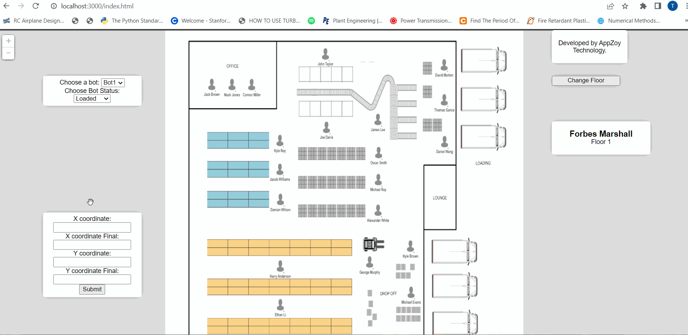

# Indoor-Mapping
Indoor mapping is the means of using various technologies to determine the location of a device indoors.
<h2> Technology Used </h2>

<h2>Project Overview </h2>

 Indoor mapping is the means of using various technologies to determine the location of a device indoors. While indoor mapping shares similarities with GPS tracking, it does not rely on satellite tracking technology as satellite waves are not strong enough to penetrate roofs and walls. Instead, indoor mapping technology and indoor mapping software offer accurate information within buildings.Indoor mapping can be achieved with the use of various location-based technologies. Together, they work to help businesses identify the positions of users (device carriers), specific destinations and other assets.

<h2> Project </h2>

